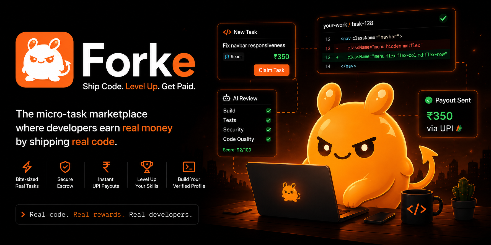
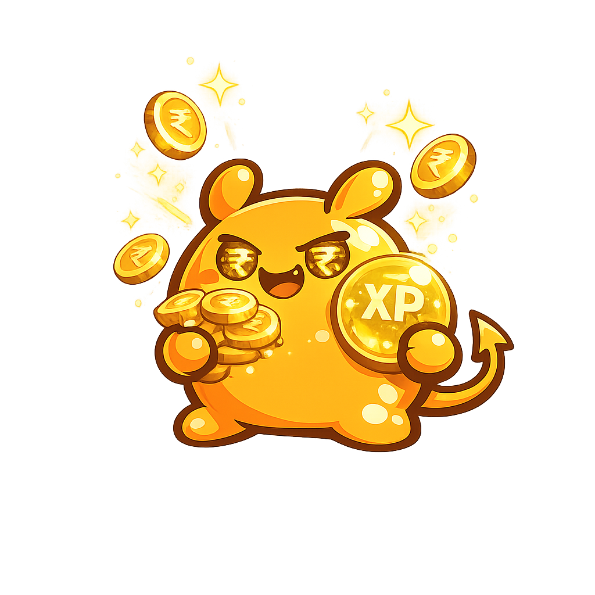

  

  <i>No fake projects, no long commitments, just bite-sized work with instant UPI payouts.</i>

---

## 👋 Welcome to Forke!

Building fake CRUD apps doesn't impress recruiters. On the other side, traditional freelancing platforms require overwhelming self-marketing, proposal bidding wars, and long timelines.

**Forke is the playground where skill meets real-world rewards.**

We connect early-career developers and students with startups and indie founders who need small, highly-scoped tasks done—like fixing a bug, building a landing page section, or wiring up an API. 

It's **Fiverr × GitHub × an RPG video game** — built for developers who want to earn, not just learn.

---

## 🚀 For Developers: Ship Code, Level Up, Get Paid

Forget dry resumes and competitive bidding wars. On Forke, your code does the talking.

* 💰 **Earn Real Cash:** Solve actual, bite-sized tasks and get paid instantly to your UPI ID via a secure Razorpay escrow as soon as your work is approved.
* 🎮 **RPG Progression System:** Every task you complete awards you XP. Climb the ranks from **Script Kiddie** to **Sprint Soldier**, all the way to **Forke Legend**, unlocking exclusive platform perks and higher-paying tasks along the way.
* 📝 **Verified Proof of Work:** As you complete tasks, Forke automatically builds a gorgeous public developer portfolio for you. Every contribution is verified, timestamped, and linked directly to your GitHub commits so recruiters know your skills are 100% real.

---

## 💼 For Founders & Startups: Micro-Task Velocity

Need a quick feature built or a bug squashed, but don't want to hire a full-time freelancer?

* ⚡ **Ship in Hours, Not Weeks:** Post highly scoped micro-tasks (30 minutes to 4 hours) with a fixed budget and get matched with verified talent instantly.
* 🤖 **AI-Assisted Quality:** Every submission goes through a automated suite of checks and a deep AI code review powered by Claude before it ever hits your dashboard. You review a clean, plain-English summary of the changes.
* 🔒 **Escrow Protection:** Deposit the task budget safely. Funds are only released to the developer once you review and approve their work.

---

## 🍊 Meet Forky!

**Forky** is Forke's official mascot—a mischievous, chibi orange creature who supports you throughout your entire developer journey! He reacts dynamically to what you do on the platform:

   &nbsp;&nbsp;&nbsp;&nbsp;
   &nbsp;&nbsp;&nbsp;&nbsp;
   &nbsp;&nbsp;&nbsp;&nbsp;
  

---

## ✨ Get Started Today

* 🛠️ **Want to build & earn?** Sign up as a **Developer**, connect your GitHub, and claim your first micro-task.
* 🚀 **Want to delegate & ship?** Apply as a **Client**, post a scoped task, and watch top-tier developers solve it in record time.

---

  <b>Prove skill by shipping. Your profile is your reputation.</b>

